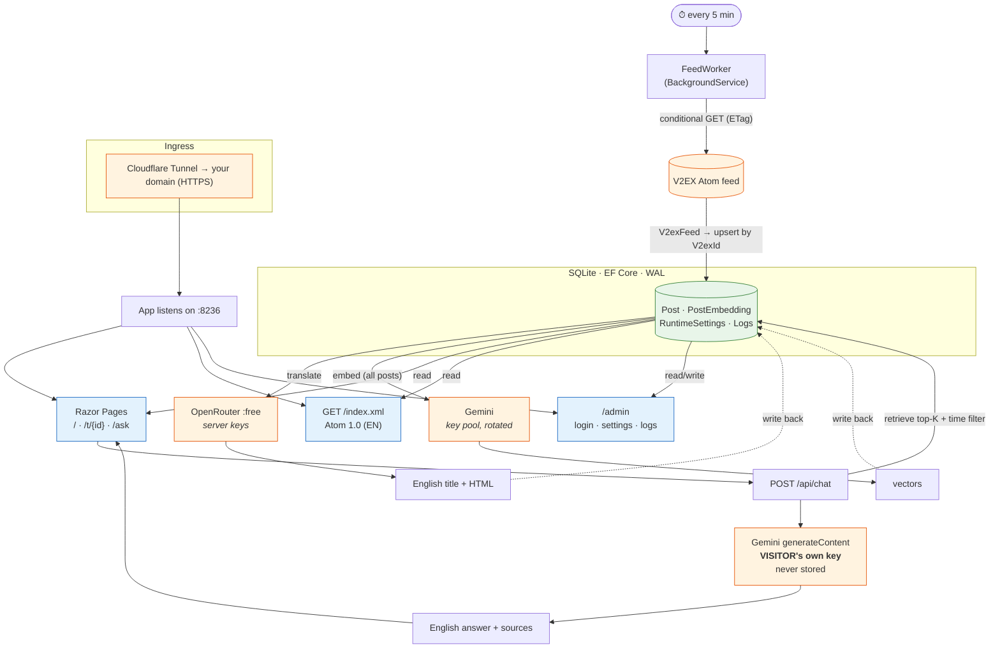

# 🌐 v2en

Mirrors the [V2EX](https://www.v2ex.com) front-page feed → **translates it to English** (via [OpenRouter](https://openrouter.ai) free models) → and lets anyone **🔎 ask the feed** in natural language (RAG over post embeddings, answered with the visitor's own [Google AI Studio](https://aistudio.google.com/apikey) key).

All API keys & models are managed in an **admin dashboard** (stored in SQLite). The app runs without keys — features just pause until you set them.

---

## 🧭 Architecture



---

## 🚀 Quick start

```bash
dotnet ef database update      # apply migrations (prod auto-applies at startup)
dotnet run                     # starts on http://localhost:8236
```

Then open **`/admin`** (the first-run password is printed in the logs, or set `Admin__Password`):

| In the dashboard | What it enables |
|---|---|
| Settings → **OpenRouter key** | Translation |
| Settings → **Gemini keys** (one per line) + **embedding model** | Search index |
| Settings → **Enable chat** + **chat model** | Public `/ask` chat |

> 🔑 Models load **live** from the provider once a key is saved — nothing is hardcoded.

---

## 🌍 Endpoints

| Path | Description |
|---|---|
| `/` · `/t/{id}` | Translated posts (same URL shape as V2EX) |
| `/ask` | 🔎 Ask-the-feed chat (visitor brings their own Gemini key) |
| `/index.xml` | English Atom 1.0 feed |
| `/admin` | Admin dashboard (login required) |
| `/healthz` | Health check |

---

## 🔑 Keys & models (all set in the dashboard)

| Key | Used for | Whose key |
|---|---|---|
| OpenRouter `:free` model | Translating posts | **Server** (admin) |
| Google AI Studio pool | Embedding every post (rotated on rate-limit) | **Server** (admin) |
| Google AI Studio | Generating chat answers | **Each visitor's own** |

Keys live in SQLite (`/data/v2en.db`). They can also be **seeded** from env on first run:
`OpenRouter__ApiKey`, `Gemini__EmbedKeys__0`, `Admin__Username`, `Admin__Password`, `Site__BaseUrl`.

---

## 🐳 Deploy (Docker)

```bash
export OPENROUTER_API_KEY=sk-or-...          # optional seed (or set later in /admin)
export SITE_BASE_URL=https://your-domain.example
docker compose up -d --build
```

Data persists in the `v2en-data` volume (`/data`). Point your **Cloudflare Tunnel → `http://<host>:8236`** (the app never handles TLS).

---

## ⚙️ How it works

- **Translate** — newest posts first, one OpenRouter `:free` call each, paced; falls back through a model chain. Daily cap or **Unlimited** mode (until OpenRouter's free limit).
- **Embed** — every post (original Chinese, multilingual model) so the whole feed is searchable even before it's translated. Server key pool is rotated to multiply free quota.
- **Ask** — embed the question → cosine top-K over the vectors (+ time window) → Gemini writes an **English** answer with source links. 🇬🇧 **English questions only** — others get asked to rephrase.

> ⚠️ Free tiers are limited. Embedding hundreds of posts/day needs several pooled Gemini keys; translation keeps up best with the ~1000/day OpenRouter free limit (one-time $10 credit, still `$0/call`).

---

## ⚠️ Disclaimer

Unofficial translated mirror. Content belongs to [V2EX](https://www.v2ex.com) and its authors. Translations & answers are AI-generated and may be inaccurate. Not affiliated with V2EX.
