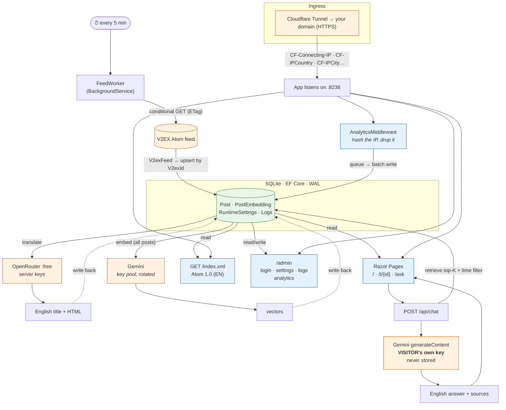

# 🌐 v2en

Mirrors the [V2EX](https://www.v2ex.com) front-page feed → **translates it to English** (via [OpenRouter](https://openrouter.ai) free models) → and lets anyone **🔎 ask the feed** in natural language (RAG over post embeddings, answered with the visitor's own [Google AI Studio](https://aistudio.google.com/apikey) key).

All API keys & models are managed in an **admin dashboard** (stored in SQLite). The app runs without keys — features just pause until you set them.

---

## 🧭 Architecture


```mermaid
flowchart TD
    Timer(["⏱ every 5 min"]) --> FW["FeedWorker<br/>(BackgroundService)"]
    FW -->|"conditional GET (ETag)"| V2EX[("V2EX Atom feed")]
    V2EX -->|"V2exFeed → upsert by V2exId"| DB

    subgraph Storage["SQLite · EF Core · WAL"]
        DB[("Post · PostEmbedding<br/>RuntimeSettings · Logs")]
    end

    DB -->|translate| OR["OpenRouter :free<br/><i>server keys</i>"]
    OR --> T["English title + HTML"]
    T -.->|write back| DB

    DB -->|"embed (all posts)"| GEM["Gemini<br/><i>key pool, rotated</i>"]
    GEM --> VEC["vectors"]
    VEC -.->|write back| DB

    DB -->|read| RP["Razor Pages<br/>/ · /t/{id} · /ask"]
    DB -->|read| FEED["GET /index.xml<br/>Atom 1.0 (EN)"]

    RP --> CHAT["POST /api/chat"]
    CHAT -->|"retrieve top-K + time filter"| DB
    CHAT --> GC["Gemini generateContent<br/><b>VISITOR's own key</b><br/>never stored"]
    GC --> ANS["English answer + sources"]
    ANS --> RP

    DB -->|read/write| ADMIN["/admin<br/>login · settings · logs<br/>analytics"]

    subgraph Edge["Ingress"]
        CF["Cloudflare Tunnel → your domain (HTTPS)"]
    end
    CF -->|"CF-Connecting-IP · CF-IPCountry · CF-IPCity…"| APP["App listens on :8236"]
    APP --> AN["AnalyticsMiddleware<br/><i>hash the IP, drop it</i>"]
    AN -->|"queue → batch write"| DB
    APP --> RP
    APP --> FEED
    APP --> ADMIN

    classDef ext fill:#fff3e0,stroke:#e65100
    classDef store fill:#e8f5e9,stroke:#2e7d32
    classDef vis fill:#e3f2fd,stroke:#1565c0
    class V2EX,OR,GEM,GC,CF ext
    class DB store
    class RP,FEED,ADMIN,AN vis
```

---

## 🚀 Quick start

```bash
dotnet ef database update      # apply migrations (prod auto-applies at startup)
dotnet run                     # starts on http://localhost:8236
```

Then open **`/admin`** (the first-run password is printed in the logs, or set `Admin__Password`):

| In the dashboard | What it enables |
|---|---|
| Settings → **OpenRouter key** | Translation |
| Settings → **Gemini keys** (one per line) + **embedding model** | Search index |
| Settings → **Enable chat** + **chat model** | Public `/ask` chat |

> 🔑 Models load **live** from the provider once a key is saved — nothing is hardcoded.

---

## 🌍 Endpoints

| Path | Description |
|---|---|
| `/` · `/t/{id}` | Translated posts (same URL shape as V2EX) |
| `/ask` | 🔎 Ask-the-feed chat (visitor brings their own Gemini key) |
| `/index.xml` | English Atom 1.0 feed |
| `/admin` | Admin dashboard (login required) |
| `/admin/analytics` | 📈 Traffic dashboard (login required) |
| `/healthz` | Health check |

---

## 🔑 Keys & models (all set in the dashboard)

| Key | Used for | Whose key |
|---|---|---|
| OpenRouter `:free` model | Translating posts | **Server** (admin) |
| Google AI Studio pool | Embedding every post (rotated on rate-limit) | **Server** (admin) |
| Google AI Studio | Generating chat answers | **Each visitor's own** |

Keys live in SQLite (`/data/v2en.db`). They can also be **seeded** from env on first run:
`OpenRouter__ApiKey`, `Gemini__EmbedKeys__0`, `Admin__Username`, `Admin__Password`, `Site__BaseUrl`.

---

## 🐳 Deploy (Docker)

```bash
export OPENROUTER_API_KEY=sk-or-...          # optional seed (or set later in /admin)
export SITE_BASE_URL=https://your-domain.example
docker compose up -d --build
```

Data persists in the `v2en-data` volume (`/data`). Point your **Cloudflare Tunnel → `http://<host>:8236`** (the app never handles TLS).

---

## ⚙️ How it works

- **Translate** — newest posts first, one OpenRouter `:free` call each, paced; falls back through a model chain. Daily cap or **Unlimited** mode (until OpenRouter's free limit).
- **Embed** — every post (original Chinese, multilingual model) so the whole feed is searchable even before it's translated. Server key pool is rotated to multiply free quota.
- **Ask** — embed the question → cosine top-K over the vectors (+ time window) → Gemini writes an **English** answer with source links. 🇬🇧 **English questions only** — others get asked to rephrase.

---

## 📈 Analytics (privacy-preserving)

Because the site is served through a **Cloudflare tunnel**, the origin already sees who is visiting
from where — `/admin/analytics` turns that into a dashboard: headline metrics with period-over-period
deltas, a traffic trend, a world map, country / page / referrer / device breakdowns and a recent-visits
table. Date range, custom dates and a bots toggle are all deep-linkable.

**No IP address is ever stored.** The visitor's address is used once, in memory, to compute

```
visitor = HMAC-SHA256(key: per-install random salt, "UTC-date | ip | user-agent")   → 128 bits, hex
```

It cannot be reversed, and because the UTC date is mixed in, **the same person gets a different id
tomorrow** — "unique visitors" is a same-day metric by construction, and nobody can be followed across
days. The salt is generated on first startup, stored only in the server's own database, and is redacted
in the `/admin/data` browser. The admin API never returns more than the first 8 hex characters.

| Cloudflare header | Used for | Availability |
|---|---|---|
| `CF-Connecting-IP` | visitor hash only (never stored) | all plans |
| `CF-IPCountry` | country + map placement | all plans |
| `CF-IPCity` · `CF-Region` · `CF-IPLatitude` · `CF-IPLongitude` · `CF-Timezone` · `CF-IPContinent` | city-level map markers | needs the *Add visitor location headers* managed transform |
| `CF-Ray` | edge datacenter (colo) | all plans |

Every one of them is optional. A request that never touched Cloudflare — local development, a direct
hit, a health check — is still recorded and simply reads as **unknown location**; with only
`CF-IPCountry` the visit is plotted at the country's centre and marked *approximate*. `CF-Connecting-IP`
falls back to `True-Client-IP` → `X-Forwarded-For` → the socket address.

Collection runs **off the request path**: the middleware queues a row on a bounded in-memory channel
and a background writer batches it into SQLite, so a page never waits on analytics and a burst is shed
rather than slowing the site down. Static assets, `/api/*`, `/healthz` and `/admin` are not counted,
and `DNT: 1` / `Sec-GPC: 1` are honoured.

All of it is configured in **Settings → Analytics** (on by default, 90-day retention) — there is no new
`appsettings.json` key to set. The map outline and the country table are built from
[Natural Earth](https://www.naturalearthdata.com) (public domain) and served from `wwwroot/`, so the
dashboard loads no third-party scripts.

> ⚠️ The origin trusts the `CF-*` headers it is given. That is correct behind a Cloudflare tunnel (only
> Cloudflare can reach it); if you ever expose the origin directly, a client could forge them and skew
> the location numbers. Nothing else — and no IP — is at stake either way.

---

> ⚠️ Free tiers are limited. Embedding hundreds of posts/day needs several pooled Gemini keys; translation keeps up best with the ~1000/day OpenRouter free limit (one-time $10 credit, still `$0/call`).

---

## ⚠️ Disclaimer

Unofficial translated mirror. Content belongs to [V2EX](https://www.v2ex.com) and its authors. Translations & answers are AI-generated and may be inaccurate. Not affiliated with V2EX.
